# LiDARTag
## Overview
This is a package for LiDARTag, described in paper: **LiDARTag: A Real-Time Fiducial Tag for Point Clouds** ([PDF](./LiDARTag.pdf))([arXiv](https://arxiv.org/abs/1908.10349)).


Image-based fiducial markers are useful in problems such as object tracking in cluttered or textureless environments, camera (and multi-sensor) calibration tasks, and vision-based simultaneous localization and mapping (SLAM). However, the state-of-the-art fiducial marker detection algorithms rely on the consistency of the ambient lighting. To the best of our knowledge, there are no existing fiducial markers for point clouds.

This paper introduces LiDARTag, a novel fiducial tag design and detection algorithm suitable for LiDAR point clouds. The proposed method runs in real-time and can process data at 100 Hz, which is faster than the currently available LiDAR sensor frequencies. Additionally, the software works with different marker sizes in cluttered indoors and spacious outdoors, even when it is entirely dark. Because of the LiDAR sensors' nature, rapidly changing ambient lighting will not affect the detection of a LiDARTag. Therefore, LiDARTag can be used in tandem with camera-based markers to address the issue of images being sensitive to ambient lighting.

* Author: Jiunn-Kai (Bruce) Huang, Shoutian Wang, Maani Ghaffari, and Jessy W. Grizzle
* Maintainer: [Bruce JK Huang](https://www.brucerobot.com/), brucejkh[at]gmail.com
* Affiliation: [The Biped Lab](https://www.biped.solutions/), the University of Michigan

This package has been tested under [ROS] Melodic and Ubuntu 18.04.\
**[Note]** More detailed introduction will be updated shortly. Sorry for the inconvenient!\
**[Issues]** If you encounter _any_ issues, I would be happy to help. If you cannot find a related one in the existing issues, please open a new one. I will try my best to help!


## Abstract
Image-based fiducial markers are useful in problems such as object tracking in cluttered or textureless environments, camera (and multi-sensor) calibration tasks, and vision-based simultaneous localization and mapping (SLAM). The state-of-the-art fiducial marker detection algorithms rely on the consistency of the ambient lighting. This paper introduces LiDARTag, a novel fiducial tag design and detection algorithm suitable for light detection and ranging (LiDAR) point clouds. The proposed method runs in real-time and can process data at 100 Hz, which is faster than the currently available LiDAR sensor frequencies. Because of the LiDAR sensors' nature, rapidly changing ambient lighting will not affect the detection of a LiDARTag; hence, the proposed fiducial marker can operate in a completely dark environment. In addition, the LiDARTag nicely complements and is compatible with existing visual fiducial markers, such as AprilTags, allowing for efficient multi-sensor fusion and calibration tasks. We further propose a concept of minimizing a fitting error between a point cloud and the marker's template to estimate the marker's pose. The proposed method achieves millimeter error in translation and a few degrees in rotation.  Due to LiDAR returns' sparsity, the point cloud is lifted to a continuous function in a reproducing kernel Hilbert space where the inner product can be used to determine a marker's ID. The experimental results, verified by a motion capture system, confirm that the proposed method can reliably provide a tag's pose and unique ID code. The rejection of false positives is validated on the [Google Cartographer](https://google-cartographer-ros.readthedocs.io/en/latest/data.html) dataset and the outdoor [Honda H3D](https://usa.honda-ri.com/H3D) datasets. All implementations are coded in C++ and are available at: [https://github.com/UMich-BipedLab/LiDARTag](https://github.com/UMich-BipedLab/LiDARTag).


## Video
Please checkout the introduction [video](https://www.brucerobot.com/lidartag). It highlights some important keypoints in the paper!
[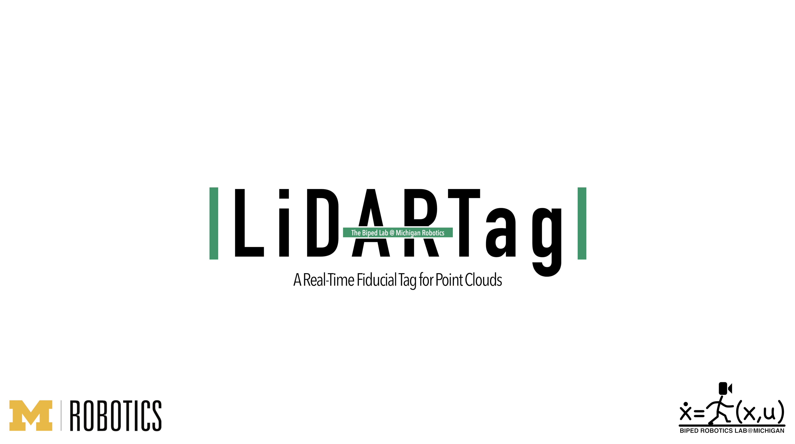](https://www.brucerobot.com/lidartag)


## Quick View
LiDAR-based markers can be used in tandem with camera-based markers to address the issue of images being sensitive to ambient lighting. LiDARTags have been successfully applied to LiDAR-camera extrinsic calibration ([paper](https://ieeexplore.ieee.org/document/9145571), [GitHub](https://github.com/UMich-BipedLab/extrinsic_lidar_camera_calibration)). This figure shows a visualization of LiDARTags of two different sizes in a full point cloud scan.

This system runs in real-time (over 100 Hz) while  handling a full scan of the point cloud; it achieves millimeter accuracy  in translation and a few degrees of error in rotation. The tag decoding accuracy is 99.7%.

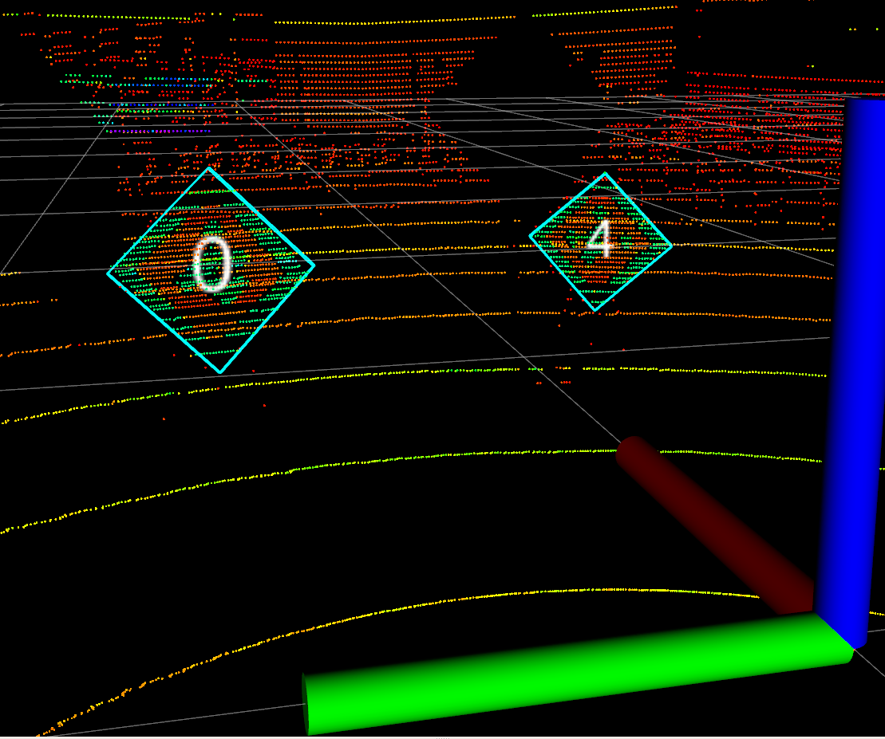
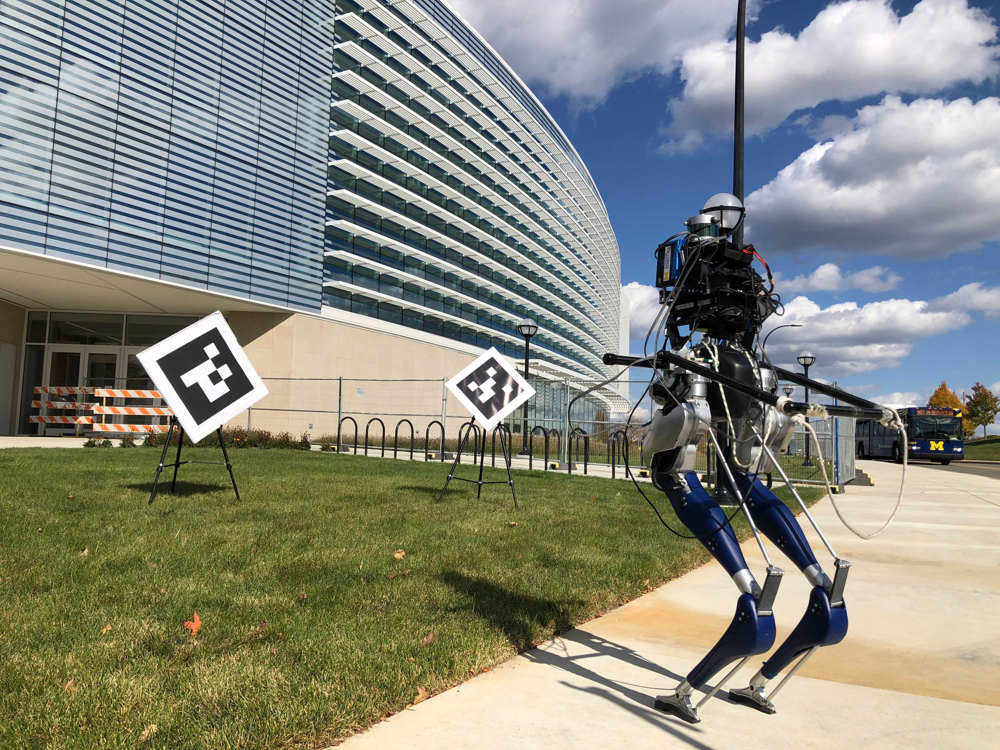

## Why LiDAR?
Robust to lighting!!\
  

## Overall pipeline
The system contains three parts: tag detection, pose estimation, and tag decoding. The detection step takes an entire LiDAR scan (up to 120,000 points from a 32-Beam Velodyne ULTRA Puck LiDAR) and outputs collections of likely payload points of the LiDARTag. Next, a tag's optimal pose minimizes the -inspired cost in (8), though the rotation of the tag about a normal vector to the tag may be off by  or  and will be resolved in the decoding process. The tag's ID is decoded with a pre-computed function library. The decoded tag removes the rotation ambiguity about the normal.

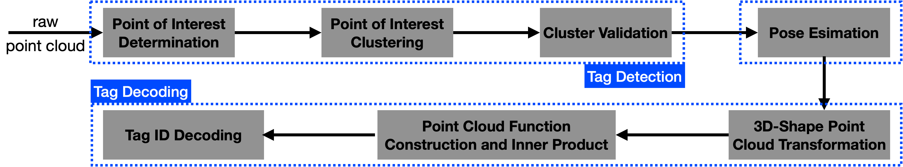


## Package Analysis
We present performance evaluations of the LiDARTag where ground truth data are provided by a motion capture system with 30 motion capture cameras. We also extensively analyze each step in the system with spacious outdoor and cluttered indoor environments. Additionally, we report the rate of false positives validated on the indoor [Google Cartographer](https://google-cartographer-ros.readthedocs.io/en/latest/data.html) dataset and the outdoor [Honda H3D](https://usa.honda-ri.com/H3D) datasets.

#### Pose and Decoding Analysis
Decoding accuracy of the RKHS method and pose accuracy of the fitting method. The ground truth is provided by a motion capture system with 30 motion capture cameras. The distance is in meters. The translation error is in millimeters and rotation error is the misalignment angle, (23), in degrees.
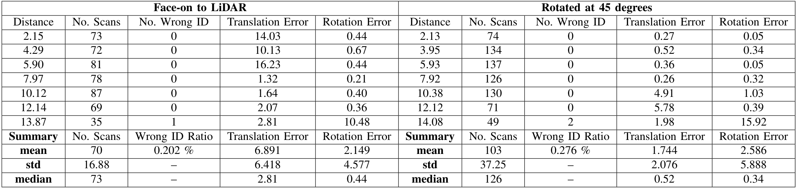

#### Computation Time of Each Step Analysis
This table averages all the datasets we collected and describes computation time of each step for indoors and outdoors.

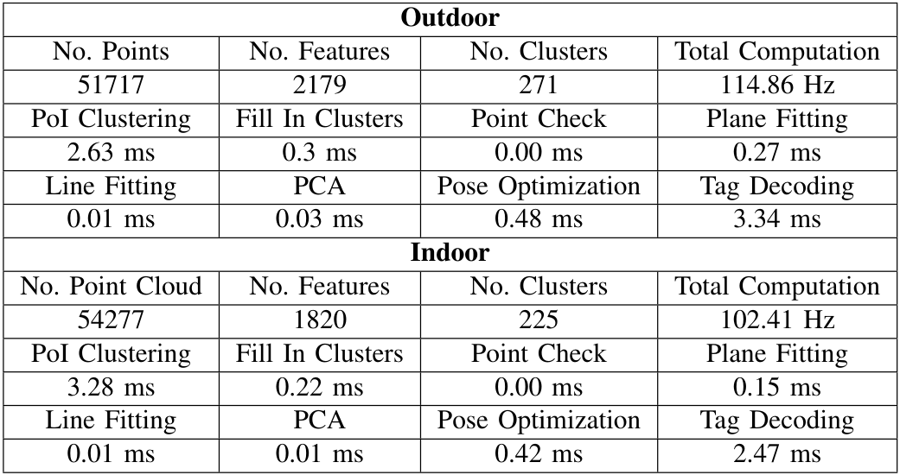

### Cluster Rejection Analysis
This table takes into account all the data we collected and shows numbers of rejected clusters in each step in different scenes. Additionally, we also report false positive rejection for [Google Cartographer](https://google-cartographer-ros.readthedocs.io/en/latest/data.html) dataset and [Honda H3D](https://usa.honda-ri.com/H3D) datasets.
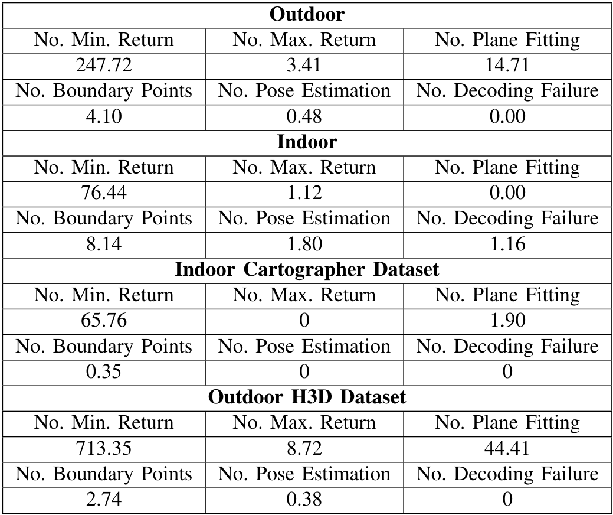

#### Double-Sum Analysis
The original double sum in (18) is too slow to achieve a real-time application. This table compares different methods to compute the double sum, in which the TBB stands for Threading Building Blocks library from Intel. Additionally, we also apply a k-d tree data structure to speed up the querying process; the k-d tree, however, does not produce fast enough results. The unit in the table is milliseconds.
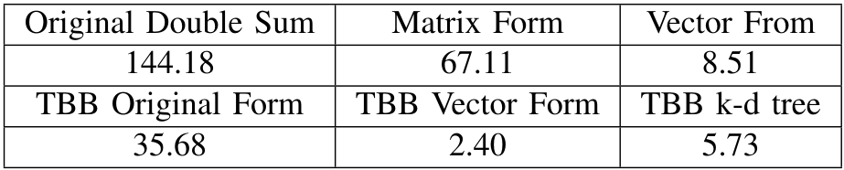

#### False Positives Analysis
This table shows the numbers of false positive rejection of the proposed algorithm. We validated the rejection rate on the indoor [Google Cartographer](https://google-cartographer-ros.readthedocs.io/en/latest/data.html) dataset and the outdoor [Honda H3D](https://usa.honda-ri.com/H3D) datasets. The former has two VLP-16 Velodyne LiDAR and the latter has one 64-beam Velodyne LiDAR.
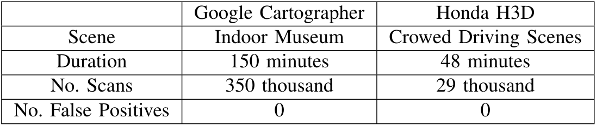

## Required Libraries / Packages
Those are the packages used in the LiDARTag package. It seems many but if you follow my steps, it should take you no more than 30 mins to instal them (including building time!). It took me awhile to get everything right. I summarize how I installed them [here](#installation-of-related-libraries). However, you may choose any way you want to install them.
1. Please install [ROS Melodic](http://wiki.ros.org/melodic/Installation/Ubuntu).
2. Please install [TBB library](https://github.com/oneapi-src/oneTBB). You may need to modify the CMakeLists.txt according to your installation.
3. Please install [NLopt](https://nlopt.readthedocs.io/en/latest/). You may need to midify the CMakeLists.txt according to your installation.
4. Please download [LiDARTag_msgs](https://github.com/UMich-BipedLab/LiDARTag_msgs) and place them under your catkin workspace.

## Installation of Related Libraries
### ROS Melodic
Please directly follow the instruction on the official website ([here](http://wiki.ros.org/melodic/Installation/Ubuntu)).

### TBB library
###### Installation
Original TBB package from Intel does not support CMake; I, therefore, use another repository that supports CMake to make my life easier.
```
git clone https://github.com/wjakob/tbb
mkdir build;
cd build;
cmake ..;
cmake --build . --config Release -- -j 6;
sudo cmake --build . --target install
```

###### Notes
Ensure the followings in the CMakeList.txt are correct:
1. FindTBB.cmake is under _LiDARTag/cmake/_
2. LIST(APPEND CMAKE_MODULE_PATH "YOUR_PATH/LiDARTag/cmake/")
	* Please change **YOUR_PATH** to your path to the LiDARTag package (something like this: catkin/src/LiDARTag/cmake).


### NLopt library
###### Installation
Please direct follow the instruction on the official website ([here](https://nlopt.readthedocs.io/en/latest/NLopt_Installation/)) or as follow:
```
git clone git://github.com/stevengj/nlopt
cd nlopt
mkdir build
cd build
cmake ..
make
sudo make install
```

### LiDARTag package
1. Once you place LiDARTag_msgs under your catkin workspace and installed all the required libraries, you can directly `catkin_make` the package.
2. `source devel/setup.bash`
3. `roslaunch lidartag LiDARTag_twotags.launch`
4. `rosbag play -l -q bagfile.bag`


## Datasets and Results
### Quantitative results:
If you would like to see how the tables in the paper are generated, please follow as below:
1. Download [this folder](https://drive.google.com/drive/folders/16bJx_Hc7iqy5-rxjWVgXOhvJGULu4hI9?usp=sharing).
2. Put them under _LiDARTag/matlab/paper_data/_
3. Run _genTable.m_ located at _LiDARTag/matlab/_


To regenerate results on the paper from scratch, please download the two datasets below:
1. Please download bagfiles from [here](https://drive.google.com/drive/folders/1k-p3q2hl1ZRIcle1lfcS0AN-DAK91RMw?usp=sharing).
2. Please download motion capture data from [here](https://drive.google.com/drive/folders/1rWCRsktFPZiOyQopwG7vCXatqwU-EyFb?usp=sharing)
3. change the _output_path_ in the launch file
4. `roslaunch lidartag LiDARTag_threetags.launch`

###### Note
The target sizes in the quantitative result folder are 1.22.

### Qualitative results:
1. Please download bagfiles from [here](https://drive.google.com/drive/folders/19w13uJNMax9_fNIzmFZwzYq2LpJsjKKh?usp=sharing).
2. `roslaunch lidartag LiDARTag_twotags.launch`

###### Note
The target sizes in the qualitative result folder are 0.8051, 0.61.


### False positive rejection:
Please download [Google Cartographer](https://google-cartographer-ros.readthedocs.io/en/latest/data.html) dataset and [Honda H3D](https://usa.honda-ri.com/H3D) datasets.
We also provide different launch files (cartographer.launch, H3D.launch) for different datasets due to different published LiDAR topics and different _output_path_. I also wrote my own parsing script to pass bin files to rosbag. Please let me know if anyone needs it.


## Running
1. Please download qualitative bagfiles from [here](https://drive.google.com/drive/folders/19w13uJNMax9_fNIzmFZwzYq2LpJsjKKh?usp=sharing).
2. `catkin_make` the package.
3. `source devel/setup.bash`
4. `roslaunch lidartag LiDARTag_twotags.launch`
5. `rosbag play -l -q bagfile.bag`
6. To see the results, `rosrun rviz rviz`. You can directly open _LiDARTag.rviz_ under _LiDARTag/rviz/_ folder.


###### Notes
This package provides several launch files that you can directly run the package.\
Please remember to change the **tag_size_list** in a launch file according to your target sizes or which bag file you are playing, or what marker sizes you have.\
Different launch files:\
-- LiDARTag_smallest.launch: only the smallest tag (0.61)\
-- LiDARTag_twotags.launch: two smaller tags (0.61, 0.8)\
-- LiDARTag_threetags.launch: all tags (0.8, 0.61, 1.22)\
Please note that, the clearance around the markers should larger than , where  is the size of the **largest** marker. Therefore, it is recommended to use smaller tags in indoor environments.


## Building Your Markers
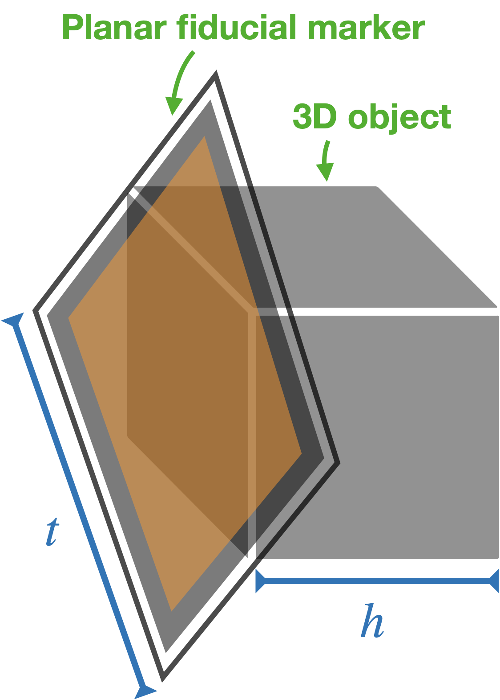 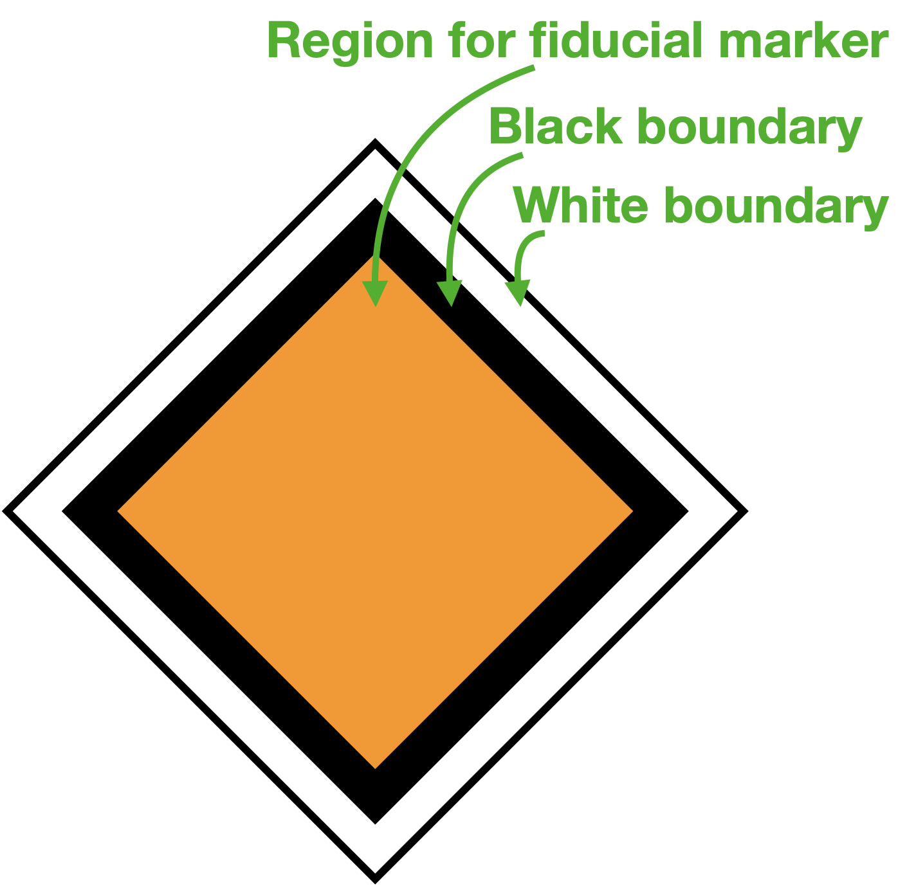 \
We provide tag16h6c5 from AprilTag3 with three sizes (0.61, 0.85, 1.2).\
If you want to use the provided markers, it is easy:
1. Attach a fiducial marker to a squared cardboard or plexiglass and place the marker inside the yellow region. 
 	* Note: The sizes **must be** one of 0.61, 0.805, 1.22 meter, or you **have to** regenerate the function dictionary. If so, please follow [here](#building-your-own-customized-markers).
2. Find a 3D object to _support_ your marker. It could be a box or an easel.
	* Please note that, the clearance around the markers should larger than , where  is the size of the **largest** marker. Therefore, it is recommended to use smaller tags in indoor environments.
4. Follow [these steps](#running) to run the package.

## Building Your Own Customized Markers
If you would like to use your own customized markers (i.e. different types of markers or different sizes), please follow these steps:\
I. Build your function dictionary:
1. `git clone https://github.com/UMich-BipedLab/matlab_utils`
2. Add _matlab_utils_ into _build_LiDARTag_library.m_ or add _matlab_utils_ into your MATLAB path.
3. Edit **opts.img_path** in _build_LiDARTag_library.m_ according to where you put images of your fiducial markers.
4. Measure the size of your marker ()
5. Open _build_LiDARTag_library.m_ in _LiDARTag/matlab/function_dictionary/_. Change `opts.target_size_` to your marker size and run _build_LiDARTag_library.m_ to generate your function library.
6. Put the generated function dictuionary into _LiDARTag/lib/_
7. When placing the generated function dictionary in _LiDARTag/lib/_, please put different sizes into different sub-folders (0, 1, 2, 3, ...) and put them in ascending order. For example, if you have three sizes (0.6, 0.8, 1.2), then you will have three sub-folders (0, 1, 2) inside the _lib/_ folder. Please place them as follow:
    - LiDARTag/lib/0/: put 0.6-size here
    - LiDARTag/lib/1/: put 0.8-size here
    - LiDARTag/lib/2/: put 1.2-size here

II. Follow [Building Your Markers](#building-your-markers)
###### Note
All the functions that are used for testing RKHS are all released in _LiDARTag/matlab/function_dictionary/_


## Parameters of launch files
This section will be completed shortly.

## Citations
The detail is described in: **LiDARTag: A Real-Time Fiducial Tag for Point Clouds,** Jiunn-Kai Huang, Shoutian Wang, Maani Ghaffari, and Jessy W. Grizzle, ([PDF](./LiDARTag.pdf))([arXiv](https://arxiv.org/abs/1908.10349))

```
@article{huang2020lidartag,
  title={LiDARTag: A Real-Time Fiducial Tag for Point Clouds},
  author={{Jiunn-Kai Huang, Shoutian Wang, Maani Ghaffari, and Jessy W. Grizzle}},
  journal={arXiv preprint arXiv:1908.10349},
  year={2020}
}
```
